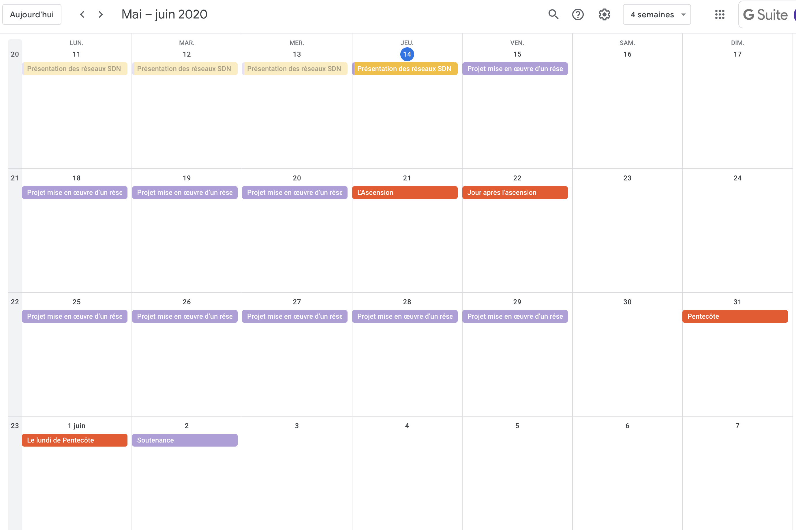

footer: [Projet Consultant réseau](https://github.com/reseau-2020), © F.-E. Goffinet, 2020
slidenumbers: true
autoscale: true
theme: Plain Jane, 1

# Projet Consultant réseau

## 1. Présentation

### 1.1. Scénario

Le client est le formateur référent, il prend les services d'une équipe de consultants réseau pour le conseiller sur la conception, la configuration et la maintenance d'une infrastructure d'essai représentative pour ses déploiements réels.

Le client a établit une sorte de cahier des charges qui énonce les modalités des relations entre lui et l'équipe, les exigences techniques, les livrables attendus et les délais associés.

Ce n'est pas dit comme tel mais il s'agit surtout pour lui d'évaluer les consultants sur leur capacité à gérer une nouvelle situation de manière optimale et "agile".

### 1.2. Modalités pratiques

#### Github

Chaque équipe travaille par projet Github dans l'organisation "[https://github.com/reseau-2020](https://github.com/reseau-2020)" et non sur votre compte personnel.

Un projet met en ensemble des repos et des personnes avec des capacités collaboratives. Chaque équipe travaille sur un seul projet commun mais peut y lier plusieurs repos.

La documentation devrait être écrite en Markdown. Les copies d'écran (images) ne sont pas nécessaires. Des copies texte suffisent.

#### Début et fin de journée / Journalier

Les 30 premières minutes et les 30 dernières minutes de la journée sont communes et le reste du temps se déroule en équipe. Chaque équipe expose et évalue son plan de la journée à ces moments de départ et de fin. Le plan est horodaté et documenté.

### 1.3. Planning

Il s'agit de travailler à partir d'un seul repo commun qui est constitué de dossiers et de fichiers (les plus bruts possibles - txt,png et non pdf,xls,doc,...) qui comprennent les configs et la documentation. Chaque jour, chaque étape plannifiée, devrait faire l'objet d'un post.

### 1.4. Méthodologie

- Lister les tâches
- Les placer dans la colonne ToDo
- Les placer dans un calendrier
- Se répartir les tâches

#### 8 jours

8 jours (3+5) qui doivent comprendre des étapes :

- d'organisation de l'équipe, de répartion des tâches, de prise en main des outils, ...
- des actions à accomplir, de construction, d'implémentation, de debug, ...
- de conception de la présentation, de répétition, ...

C'est beaucoup et peu à la fois.

## 2. Livrables

#### En continu et en final

- Une topologie et le "code" de l'infrastructure avec une description, ce que l'on appelle une "documentation".
- Une présentation de votre projet de 10 à 15 minutes (10 à 15 diapos) dans laquelle chacun.e prend la parole.

#### En continu quotidiennement

Chaque équipe livre un article journalier (écrit de manière collaborative) :

- Ce qui était prévu
- Ce qui a été réalisé par chacun
- Ce qui a été appris et confirmé

### 2.1. Topologie

- Un adressage IPv4 et IPv6 spécifique (blocs d'adresses indédits[^1]) et le protocole de routage OSPF ou EIGRP
- Deux switchblocks (4 vlans utiles) dans les couches Access et Distribution (assuré par RTSP, Etherchannel et HSRP)
- Une couche Core maillée de trois routeurs
- Un maillage entre la couche Core et les switchblock
- Un accès Internet avec un pare-feu/nat et un DMZ
- Un site distant connecté en VPN IPSEC
- Des services d'infrastuctures (NTP,DNS,DHCP,NTP/DHCPv6/DHCP Relay,RA, ...)
- Des services de surveillance (SYSLOG, SNMP)
- Le focus sécuritaire sur toutes les solutions déployés

[^1]: Bloc IPv6 HE Global Unicast fourni par le formateur.

### 2.2. Code

Le code de l'infrastructure doit reprendre au minimum :

- Un **diagramme** de la topologie
- Un **plan d'adressage** IPv4 et IPv6 (interfaces et périphériques) indédit
- Les **fichiers de configuration** de chaque périphériques
- Une **description du déploiement** (choix technologiques) et de sa gestion (contrôle, reporting, surveillance)
- Un cas qui éprouve la **fiabilité** de la solution
- Un cas qui éprouve la **sécurité** de la solution

### 2.3. Soutenance

- Chacun.e prend la parole
- 10 à 15 minutes (sujets)
- 10 à 15 minutes (questions/réponses)
- Un Powerpoint ou un site Web (à partir d'un repo Github)
- Sommaire
- Fond
- Bilan technique
- Bilan humain

## 3. Outils

### 3.1. Réunion privée

Il est recommandé d'utiliser les réunions privées dédiées https://ensemble-bbb.scaleway.com/, une par équipe, dont vous communiquez l'url au formateur via Slack.

### 3.2. Documentation

- Git : [https://rogerdudler.github.io/git-guide/index.fr.html](https://rogerdudler.github.io/git-guide/index.fr.html)
- [https://desktop.github.com/](https://desktop.github.com/)
- [https://github.com/marktext/marktext#download-and-installation](https://github.com/marktext/marktext#download-and-installation)
- Site Web : https://reseau-2020.github.io/votre-nom-de-repo avec [jekyll-docs](https://jekyllrb.com/docs/home)

### 3.3. Diagrammes

- GNS3
- [https://www.lucidchart.com/](https://www.lucidchart.com/)
- [http://go.drawthe.net/](http://go.drawthe.net/)

### 3.4. Collaboration

- Issue GitHub
- [Kanban](https://help.github.com/en/github/managing-your-work-on-github/about-project-boards)
- [Gant Mermaid](https://mermaid-js.github.io/mermaid-live-editor/#/edit/eyJjb2RlIjoiZ2FudHRcblx0dGl0bGUgQSBHYW50dCBEaWFncmFtXG5cdGRhdGVGb3JtYXQgIFlZWVktTU0tRERcblx0c2VjdGlvbiBTZWN0aW9uXG5cdEEgdGFzayAgICAgICAgICAgOmExLCAyMDE0LTAxLTAxLCAzMGRcblx0QW5vdGhlciB0YXNrICAgICA6YWZ0ZXIgYTEgICwgMjBkXG5cdHNlY3Rpb24gQW5vdGhlclxuXHRUYXNrIGluIHNlYyAgICAgIDoyMDE0LTAxLTEyICAsIDEyZFxuXHRhbm90aGVyIHRhc2sgICAgICA6IDI0ZFxuXHRcdFx0XHRcdCIsIm1lcm1haWQiOnsidGhlbWUiOiJkZWZhdWx0In0sInVwZGF0ZUVkaXRvciI6dHJ1ZX0)
- [Gantt Project](https://www.ganttproject.biz)

### 3.5. Gestion

- [https://github.com/goffinet/ansible-cisco-ccna](https://github.com/goffinet/ansible-cisco-ccna)

### 3.6. Présentation

- [Marp CLI](https://github.com/marp-team/marp-cli) et [Marp CLI Example](https://github.com/yhatt/marp-cli-example)
- [Markdown Slide Decks](https://gist.github.com/johnloy/27dd124ad40e210e91c70dd1c24ac8c8)

## 4. Objectifs à valider

- Rédiger et publier la documentation complète d'un projet informatique
- Présenter efficacement un projet informatique devant un public
- Renforcer la sécurité des périphériques du réseau
- Mettre en oeuvre le filtrage L2/L3/L7 sur les routeurs commutateurs et autres périphériques de sécurité
- Mettre en oeuvre l'authentification et le chiffrement à tous les niveaux d'une architecture
- Mettre en oeuvre les protocoles de routage RIP EIGRP OSPF et BGP dans un inter-réseau
- Mettre en oeuvre et sécuriser les protocoles L2/IEEE 802.1 dans le cadre d'architectures LAN hautement disponibles (HA)
- Mettre en oeuvre les fonctionnalités de type pare-feu y compris un UTM
- Mettre en place la surveillance et le reporting du réseau
- Faire des choix de conception d'architecture réseau et les défendre
- Appliquer les principes de l'automation des réseau infrastructure as code

## 5. Discrétion / Droits

La discrétion exige de ne citer aucun nom de famille ou d'entreprise ni aucun élément privé ou secret.

Tous les droits tombent dans le domaine public.

Le repo du site Web doit rester public.

## 6. Faq

_Faq vide pour l'instant._
